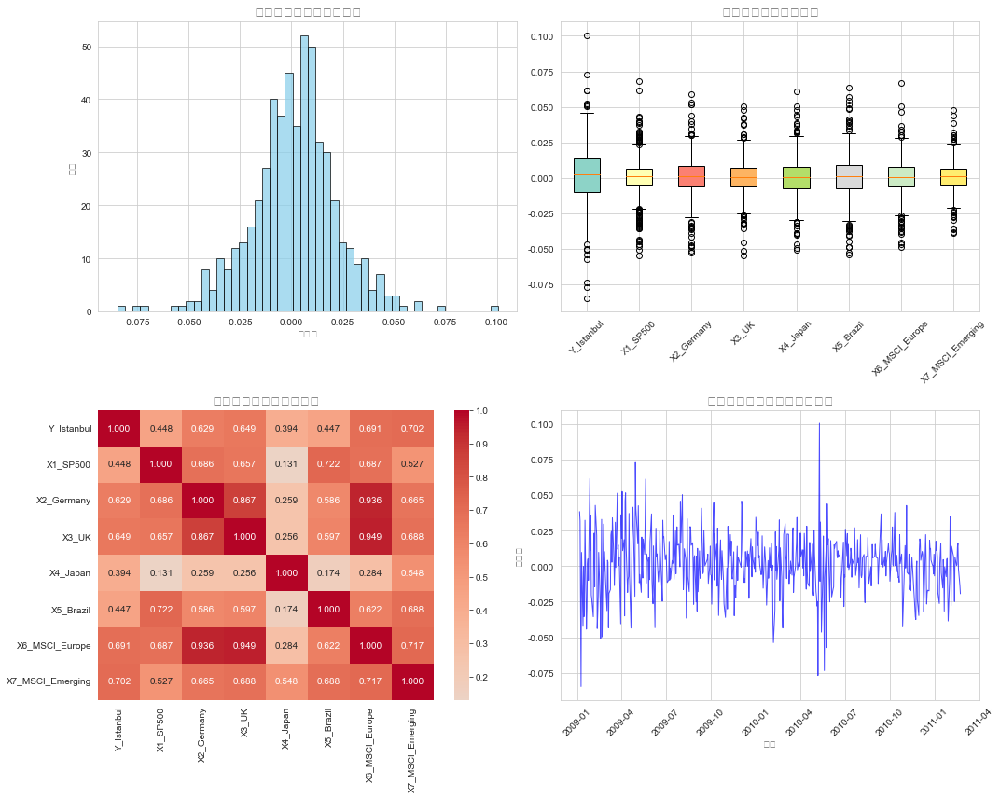
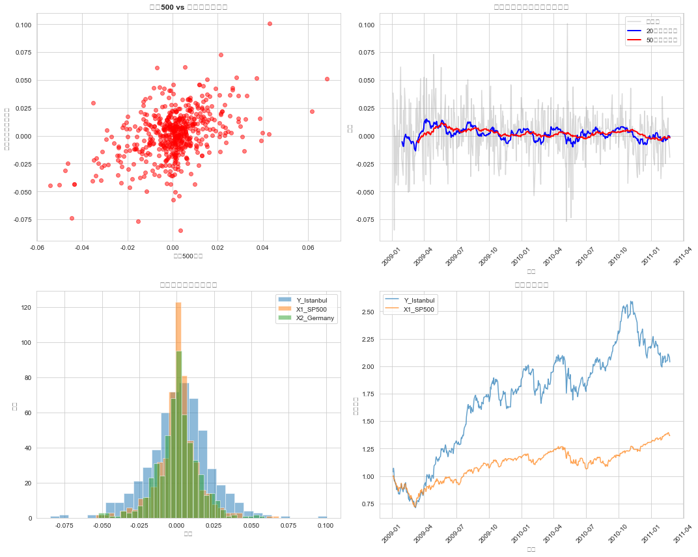
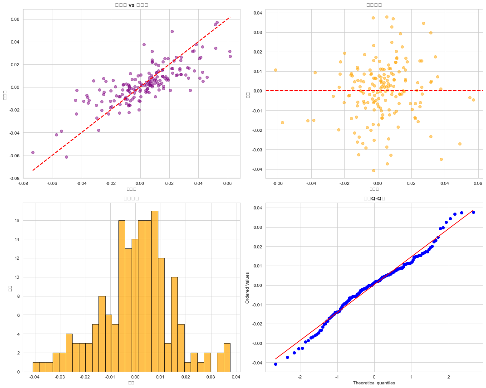

# 项目3：股票指数数据分析与回归预测

## 项目简介

对多个全球股票指数（伊斯坦布尔指数、标普500、德国指数、英国指数、日本指数、巴西指数、MSCI欧洲、MSCI新兴市场）进行探索性数据分析和回归预测建模。

## 数据说明

- 请将 `股票指数数据集.xlsx` 放入 `data/` 目录
- Notebook 已使用相对路径 `../data/股票指数数据集.xlsx`，开箱即用
- 运行后会自动生成 `data/cleaned_stock_data.csv`

## 分析流程

1. 数据读取与探索
2. 数据清洗（列重命名、类型转换、缺失值/零值处理）
3. 探索性数据分析（分布、箱线图、相关性热力图、时间序列）
4. 深入分析（散点图、移动平均、累积收益）
5. 线性回归预测建模
6. 残差分析与模型检验
7. 最终报告总结

## 分析结果可视化

### 探索性数据分析（四合一）



2×2 多面板综合图：
- 左上：伊斯坦布尔指数收益分布直方图
- 右上：8 个指数收益分布箱线图对比
- 左下：各指数收益相关性热力图
- 右下：伊斯坦布尔指数收益时间序列走势

---

### 深入分析可视化（四合一）



2×2 多面板综合图：
- 左上：标普500 vs 伊斯坦布尔指数散点图
- 右上：伊斯坦布尔指数 20 日 / 50 日移动平均趋势
- 左下：主要指数收益分布叠加对比
- 右下：前 2 个指数的累积收益趋势

---

### 残差分析（四合一）



2×2 多面板综合图，用于检验回归模型假设：
- 左上：预测值 vs 实际值散点图（含 y=x 参考线）
- 右上：残差散点图（检验随机分布）
- 左下：残差分布直方图（检验正态性）
- 右下：残差 Q-Q 图（严格正态性检验）

---

## 环境要求

```bash
pip install -r requirements.txt
```

## 运行方式

1. 确认 Excel 数据文件路径存在且可读
2. 打开 `notebooks/moni_ti.ipynb`
3. 按顺序执行所有单元格
